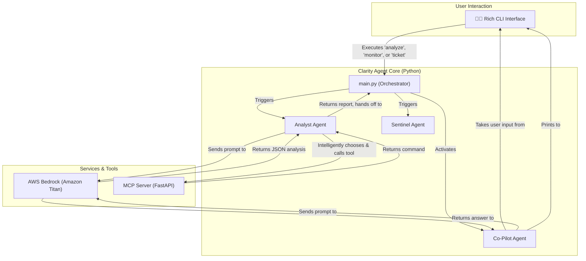

# 🤖 Clarity Agent

**AI-Powered IT Operations Automation for Incident Analysis and Remediation**

<p align="center">
  
  
  
  
  
  
</p>

Clarity Agent automates Root Cause Analysis (RCA) by analyzing logs, correlating events, and suggesting safe, context-aware remediation actions. It combines a human-friendly CLI with AWS Bedrock and an MCP-compatible tool server to shorten incident resolution from hours to minutes.

---

## ✨ **Key Capabilities: A Three-Agent AI System**

### 🔍 **1. Analyst Agent (Reactive Incident Analysis)**
-   **AI-Powered RCA**: Connects to **AWS Bedrock (Amazon Titan)** for high-confidence root cause analysis.
-   **Multi-Format Parsing**: Ingests and consolidates JSON, CSV, and plain text logs into a single timeline.
-   **Intelligent Remediation**: Intelligently selects the correct `kubectl` command (e.g., `restart` vs. `rollback`) by analyzing the AI's findings and calling a standards-compliant **MCP server**.

### 🛡️ **2. Sentinel Agent (Proactive Monitoring)**
-   **Continuous Monitoring**: Runs as a background service, automatically scanning log files for negative trends.
-   **Predictive Alerts**: Uses AI to generate high-severity warnings (e.g., "high error rate detected") *before* an incident occurs.
-   **Rich Dashboard**: Displays a professional monitoring table in the console, showing scan status in real-time.

### 🤖 **3. Co-Pilot Agent (Interactive Investigation)**
-   **Natural Language Q&A**: Activates after an analysis, providing a conversational chat interface.
-   **Context-Aware**: Maintains the full context of the logs and the initial AI analysis to provide deep, relevant answers.
-   **Learning Support**: Helps engineers of all levels understand complex incidents by asking, "What happened right before the service became unhealthy?"

### 📋 **4. Professional Ticket Generation**
-   **Automated Documentation**: A dedicated `ticket` command generates a professional, AI-powered incident report with a single click.
-   **Stakeholder Communication**: Creates a clean, Markdown-formatted summary perfect for pasting into Jira, ServiceNow, or a management email.

---

## 🏗️ Architecture



---

## 🚀 Quick Start

### Prerequisites

- Python 3.11+
- An active Python virtual environment (venv)
- AWS CLI configured with hackathon credentials (e.g., via aws configure sso)

### Installation

Clone the repository:

```bash
git clone https://github.com/kp183/clarity-agent.git
cd clarity-agent
```

Activate your virtual environment:

```bash
# On macOS / Linux
python -m venv venv
source venv/bin/activate

# On Windows (PowerShell)
.\venv\Scripts\Activate.ps1
```

Install all dependencies:

```bash
pip install "[dev]"
```

### AWS Bedrock Setup

1. Ensure your provided hackathon AWS account has access to the Amazon Bedrock service in the us-east-1 region.
2. Log in to the Bedrock console and ensure you have enabled access for the Amazon Titan model provider on the "Model access" page.
3. Log in to your AWS account via the CLI (e.g., `aws sso login ...`). The application will automatically use these credentials.

---

## 📖 Complete Usage Guide - Four-Command Workflow

### Prerequisite: Start the MCP Server (Terminal 1)
This server must be running for the analyze and ticket commands to work.

```bash
python -m clarity_agent.main start-mcp
```

1. 🔍 Reactive Analysis & 🤖 Interactive Co-Pilot (Terminal 2)

This command runs the analysis and then automatically starts the interactive chat.

```bash
python -m clarity_agent.main analyze ./logs/app_errors.log ./logs/config_changes.csv ./logs/deployment_logs.json ./logs/db_performance.log
```

After the report, type Y to start chatting with the Co-Pilot.

2. 🛡️ Proactive Monitoring (Terminal 2)

This command runs the Sentinel agent to watch for bad trends.

```bash
python -m clarity_agent.main monitor ./logs/live_db_feed.log
```

The agent will scan every 30 seconds. Press CTRL+C to stop.

3. 📋 Professional Ticket Generation (Terminal 2)

This command runs the analysis and generates a clean, copy-pasteable Markdown report.

```bash
python -m clarity_agent.main ticket ./logs/app_errors.log ./logs/config_changes.csv ./logs/deployment_logs.json ./logs/db_performance.log
```

4. 🔧 System Commands (Terminal 2)

```bash
# Check system version
python -m clarity_agent.main version

# Get help for any command
python -m clarity_agent.main --help
```

---

## 📊 Example Output (from analyze command)

```
--- Analysis Complete ---
╭────────── AI Root Cause Analysis (from AWS Bedrock) ───────────╮
│ {                                                              │
│   "summary": "Mock Analysis: Found 8 errors in 27 events.",     │
│   "root_cause_description": "The mock analysis suggests a...    │
│   "affected_components": [                                     │
│     "auth-service",                                            │
│     "database"                                                 │
│   ],                                                           │
│   "confidence_score": 0.85                                     │
│ }                                                              │
╰────────────────────────────────────────────────────────────────╯
╭───────── AI Suggested Remediation (from MCP Server) ───────────╮
│ kubectl rollout restart deployment/auth-service -n default     │
╰────────────────────────────────────────────────────────────────╯

🤖 Would you like to start an interactive investigation with the Co-Pilot Agent? [y/n]:
```

---

## 🛠️ Technical Stack

- AI Engine: AWS Bedrock (Amazon Titan)
- Tooling Protocol: Model Context Protocol (MCP) via FastAPI
- CLI Framework: Typer & Rich
- Data Processing: Pandas
- AWS Integration: Boto3
- Language: Python 3.11+ (with Asyncio)

---

## 🔮 Future Roadmap

- ✅ Phase 1: Complete — Analyst Agent (Reactive RCA)
- ✅ Phase 2: Complete — Sentinel Agent (Proactive Monitoring)
- ✅ Phase 3: Complete — Co-Pilot Agent (Interactive Investigation)
- ✅ Phase 4: Complete — Professional Ticket Generation
- 🔄 Phase 5: Future — Enterprise features: RBAC, encryption, audit trails, and integrations (Slack, Jira).

---

## License

MIT — see the LICENSE file for details.
