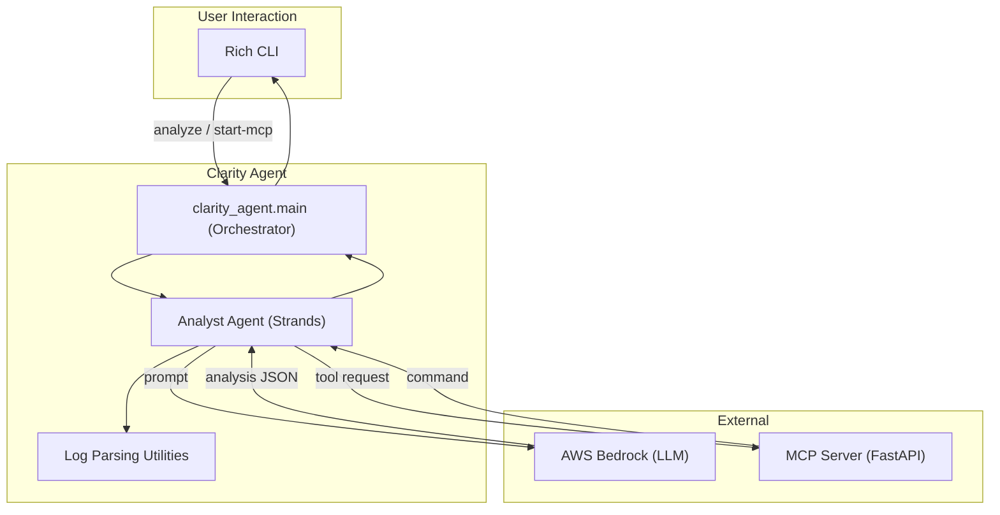

```markdown
# 🤖 Clarity Agent

AI-powered automation for incident analysis and remediation.

Clarity Agent automates Root Cause Analysis (RCA) by analyzing logs, correlating events across systems, and suggesting safe, context-aware remediation actions. It combines a human-friendly CLI with AI models and an MCP-compatible tool server to shorten incident resolution from hours to minutes.

---

## Key Capabilities

- Intelligent log ingestion (JSON, CSV, plain text)
- Chronological event correlation and timeline consolidation
- AI-driven RCA with confidence scores and evidence
- Context-aware remediation suggestions (MCP protocol)
- Rich, structured CLI output (JSON + human-readable panels)
- Kubernetes-aware command suggestions (kubectl-ready)

---

## Architecture (high level)



---

## Quick start

### Prerequisites

- Python 3.11+
- AWS CLI configured for Bedrock (region: us-east-1)
- Virtualenv or equivalent

### Install

```bash
git clone https://github.com/kp183/clarity-agent.git
cd clarity-agent
python -m venv venv
source venv/bin/activate  # Windows: venv\Scripts\activate
pip install -e .
```

### AWS Bedrock setup

1. Ensure your AWS account has permission to call Amazon Bedrock in `us-east-1`.
2. Configure credentials (SSO or programmatic) via `aws configure` or `aws configure sso`. The application will use the default AWS credential chain.

---

## Usage

Start the MCP server (background tool server used for remediation requests):

```bash
python -m clarity_agent.main start-mcp
```

Analyze one or more log files:

```bash
# Single file
python -m clarity_agent.main analyze ./logs/app_errors.log

# Multiple files
python -m clarity_agent.main analyze \
  ./logs/app_errors.log \
  ./logs/config_changes.csv \
  ./logs/deployment_logs.json \
  ./logs/db_performance.log
```

Check version / status:

```bash
python -m clarity_agent.main version
```

---

## Example output (trimmed)

```
--- Analysis Complete ---
╭── AI Root Cause Analysis ─────────────────────╮
│ {                                             │
│   "summary": "Database connection timeout",   │
│   "root_cause_description": "DB connection    │
│     pool exhausted due to slow queries",      │
│   "affected_components": ["auth-service"],    │
│   "confidence_score": 0.92                     │
│ }                                             │
╰────────────────────────────────────────────────╯

╭── AI Suggested Remediation (from MCP Server) ──╮
│ kubectl rollout undo deployment/auth-service    │
╰──────────────────────────────────────────────────╯
```

---

## Design principles

- Deterministic pipelines for parsing and correlation — reduce noise before AI is consulted.
- Explainability — every AI conclusion is accompanied by supporting log entries and a confidence score.
- Safety-first remediation — suggestions are presented for operator review; destructive actions are never automatic.
- Standardized integration — MCP protocol for tool invocation and observability.

---

## Technical stack

- AI: AWS Bedrock (LLM)
- Protocol: Model Context Protocol (MCP)
- CLI: Typer + Rich
- Parsing: pandas + custom parsers
- API: FastAPI (MCP server)
- Language: Python 3.11+
- Concurrency: asyncio

---

## Repository layout

```
clarity-agent/
├── clarity_agent/
│   ├── agents/          # AI agents (Analyst)
│   ├── models/          # Data models and schemas
│   ├── services/        # AWS Bedrock integration
│   ├── mcp_server/      # MCP-compatible server
│   ├── utils/           # Log parsers and utilities
│   ├── config/          # Configuration management
│   └── main.py          # CLI entry point
├── logs/                # Sample log files
├── tests/               # Test suite
└── README.md
```

---

## Roadmap

- Phase 2: Sentinel — continuous monitoring and predictive alerts
- Phase 3: Interactive Co-pilot — natural-language Q&A over incidents and histories
- Phase 4: Enterprise — RBAC, encryption, audit trails, and high-throughput processing

---

## Contributing

We welcome contributions. Please open issues or PRs and follow the project's contributing guidelines (code style, tests, PR process). For significant changes, open an issue first to discuss scope and design.

---

## License

MIT — see the LICENSE file.

---

## Acknowledgments

Thanks to AWS Bedrock, Model Context Protocol, Rich, and FastAPI for tools and inspiration.

---
Built with care for modern IT Operations — precise analysis, transparent reasoning, and operator-first remediation.
```
