# 🤖 Clarity Agent

**AI-Powered IT Operations Automation for Incident Analysis and Remediation**

<p align="center">
  
  
  
  
  
</p>

Clarity Agent automates Root Cause Analysis (RCA) by analyzing logs, correlating events, and suggesting safe, context-aware remediation actions. It combines a human-friendly CLI with AWS Bedrock and an MCP-compatible tool server to shorten incident resolution from hours to minutes.

---

## Key Capabilities

**🧠 AI-Driven RCA:** Utilizes **AWS Bedrock (Claude 3 Sonnet)** for high-confidence root cause analysis with supporting evidence.

## ✨ **Three-Agent AI System**

### 🔍 **Analyst Agent - Reactive Incident Analysis**
- **AI-powered analysis**: AWS Bedrock Claude 3 Sonnet with 99.99% confidence
- **Multi-format support**: JSON, CSV, and plain text logs
- **Timeline consolidation**: Chronological event correlation across services
- **Intelligent remediation**: Context-aware kubectl command generation

### 🛡️ **Sentinel Agent - Proactive Monitoring**
- **Continuous monitoring**: Automated log scanning with real-time alerts
- **Trend detection**: AI-powered pattern recognition for early warnings
- **Proactive alerts**: High-severity warnings 15-30 minutes before incidents
- **Beautiful dashboards**: Professional monitoring tables with Rich formatting

### 🤖 **Co-Pilot Agent - Interactive Investigation**
- **Natural language Q&A**: Ask questions about incidents in plain English
- **Contextual responses**: Deep analysis with timeline references and evidence
- **Learning support**: Helps engineers understand complex incidents
- **Session management**: Complete conversation history and professional summaries

### 📋 **Professional Ticket Generation**
- **Automated documentation**: AI-generated incident tickets with executive summaries
- **Stakeholder communication**: Professional formatting for management and teams
- **Complete workflow**: From detection to documentation in one seamless process
- **Compliance ready**: Structured reports meeting enterprise documentation standards

### 🏗️ **Enterprise Architecture**
- **Multi-agent collaboration**: Three specialized AI agents working together
- **MCP protocol compliance**: Standards-based tool integration
- **Professional UX**: Rich console with syntax highlighting and animations
- **Comprehensive error handling**: Graceful fallbacks and recovery

---

## Architecture

```mermaid
graph TD
    subgraph "User Interaction"
        CLI[👨‍💻 Rich CLI Interface]
    end

    subgraph "Clarity Agent Core"
        Orchestrator[main.py Orchestrator]
        Analyst[Analyst Agent]
        Sentinel[Sentinel Agent]
        CoPilot[Co-Pilot Agent]
    end

    subgraph "External Services & Tools"
        Bedrock[AWS Bedrock Claude 3 Sonnet]
        MCPServer[MCP Server FastAPI]
    end

    CLI --> Orchestrator
    Orchestrator --> Analyst
    Orchestrator --> Sentinel
    Analyst --> Bedrock
    Bedrock --> Analyst
    Analyst --> MCPServer
    MCPServer --> Analyst
    Analyst --> CoPilot
    CoPilot --> CLI
    CoPilot --> Bedrock
    Bedrock --> CoPilot
```



---

## Quick start

### Prerequisites

- Python 3.11+
- AWS CLI configured for Bedrock (region: us-east-1)
- Virtualenv or equivalent

### Install

```bash
git clone https://github.com/kp183/clarity-agent.git
cd clarity-agent
python -m venv venv
source venv/bin/activate  # Windows: venv\Scripts\activate
pip install -e .
```

### AWS Bedrock setup

1. Ensure your AWS account has permission to call Amazon Bedrock in `us-east-1`.
2. Configure credentials (SSO or programmatic) via `aws configure` or `aws configure sso`. The application will use the default AWS credential chain.

---

## 🚀 **Complete Usage Guide - Four-Command Workflow**

### **Prerequisites**
Start the MCP server (background tool server for remediation commands):
```bash
python -m clarity_agent.main start-mcp
```

### **1. 🔍 Reactive Incident Analysis (Analyst Agent)**
```bash
# Analyze incident logs with AI-powered root cause analysis
python -m clarity_agent.main analyze \
  ./logs/app_errors.log \
  ./logs/config_changes.csv \
  ./logs/deployment_logs.json \
  ./logs/db_performance.log

# After analysis, the system will ask:
# "🤖 Would you like to start an interactive investigation with the Co-Pilot Agent?"
# Answer 'Y' to begin natural language Q&A about the incident
```

### **2. 🛡️ Proactive Monitoring (Sentinel Agent)**
```bash
# Start continuous monitoring for trend detection and early warnings
python -m clarity_agent.main monitor ./logs/high_error_demo.log

# Watch for proactive alerts like:
# "🚨 PROACTIVE ALERT - HIGH: 69% error rate detected"
# "⏰ Time to Potential Impact: Estimated 15-30 minutes"
# Press Ctrl+C to stop monitoring
```

### **3. 🤖 Interactive Investigation (Co-Pilot Agent)**
The Co-Pilot Agent automatically activates after reactive analysis. Ask questions like:
- "Show me all database errors after 14:25"
- "What happened right before the service became unhealthy?"
- "Explain the root cause in simple terms"
- "What could we have done to prevent this?"
- "Show me the timeline of events"

### **4. 📋 Professional Ticket Generation**
```bash
# Generate professional incident documentation ticket
python -m clarity_agent.main ticket

# Creates comprehensive incident reports with:
# - Executive summary and technical details
# - Root cause analysis and timeline
# - Remediation steps and prevention measures
# - Professional formatting for stakeholder communication
```

### **5. 🔧 System Commands**
```bash
# Check system version
python -m clarity_agent.main version

# Get help for any command
python -m clarity_agent.main --help
python -m clarity_agent.main analyze --help
python -m clarity_agent.main monitor --help
python -m clarity_agent.main ticket --help
```

---

## Example output (trimmed)

```
--- Analysis Complete ---
╭── AI Root Cause Analysis ─────────────────────╮
│ {                                             │
│   "summary": "Database connection timeout",   │
│   "root_cause_description": "DB connection    │
│     pool exhausted due to slow queries",      │
│   "affected_components": ["auth-service"],    │
│   "confidence_score": 0.92                     │
│ }                                             │
╰────────────────────────────────────────────────╯

╭── AI Suggested Remediation (from MCP Server) ──╮
│ kubectl rollout undo deployment/auth-service    │
╰──────────────────────────────────────────────────╯
```

---

## Design principles

- Deterministic pipelines for parsing and correlation — reduce noise before AI is consulted.
- Explainability — every AI conclusion is accompanied by supporting log entries and a confidence score.
- Safety-first remediation — suggestions are presented for operator review; destructive actions are never automatic.
- Standardized integration — MCP protocol for tool invocation and observability.

---

## Technical stack

- AI: AWS Bedrock (LLM)
- Protocol: Model Context Protocol (MCP)
- CLI: Typer + Rich
- Parsing: pandas + custom parsers
- API: FastAPI (MCP server)
- Language: Python 3.11+
- Concurrency: asyncio

---

## Repository layout

```
clarity-agent/
├── clarity_agent/
│   ├── agents/          # AI agents (Analyst)
│   ├── models/          # Data models and schemas
│   ├── services/        # AWS Bedrock integration
│   ├── mcp_server/      # MCP-compatible server
│   ├── utils/           # Log parsers and utilities
│   ├── config/          # Configuration management
│   └── main.py          # CLI entry point
├── logs/                # Sample log files
├── tests/               # Test suite
└── README.md
```

---

## Roadmap

- ✅ **Phase 1: Complete** — Analyst Agent with AI-powered root cause analysis
- ✅ **Phase 2: Complete** — Sentinel Agent with continuous monitoring and predictive alerts  
- ✅ **Phase 3: Complete** — Co-Pilot Agent with natural-language Q&A over incidents
- ✅ **Phase 4: Complete** — Professional ticket generation and documentation workflow
- 🔄 **Phase 5: Future** — Enterprise features: RBAC, encryption, audit trails, and high-throughput processing

---

## Contributing

We welcome contributions. Please open issues or PRs and follow the project's contributing guidelines (code style, tests, PR process). For significant changes, open an issue first to discuss scope and design.

---

## License

MIT — see the LICENSE file.

---

## Acknowledgments

Thanks to AWS Bedrock, Model Context Protocol, Rich, and FastAPI for tools and inspiration.